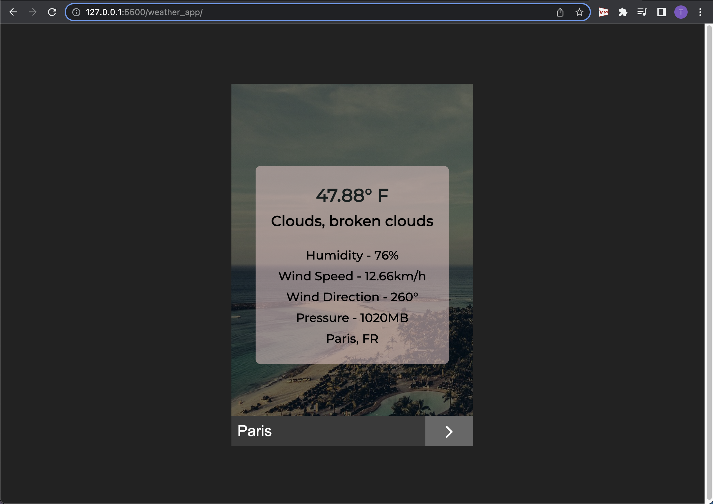

# weather-app
weather app using the api from openweathermap.org:
- Takes a city as an input
- Returns the current: temperature, conditions, humidity, 
  wind speed, wind direction, pressure, and query 
 
 
