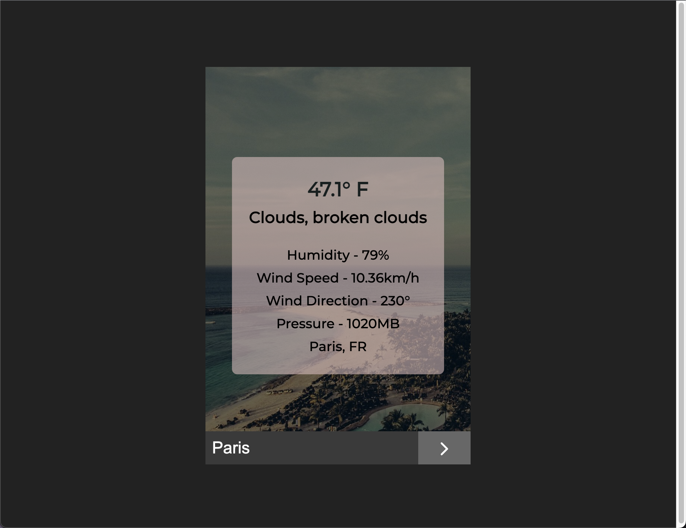
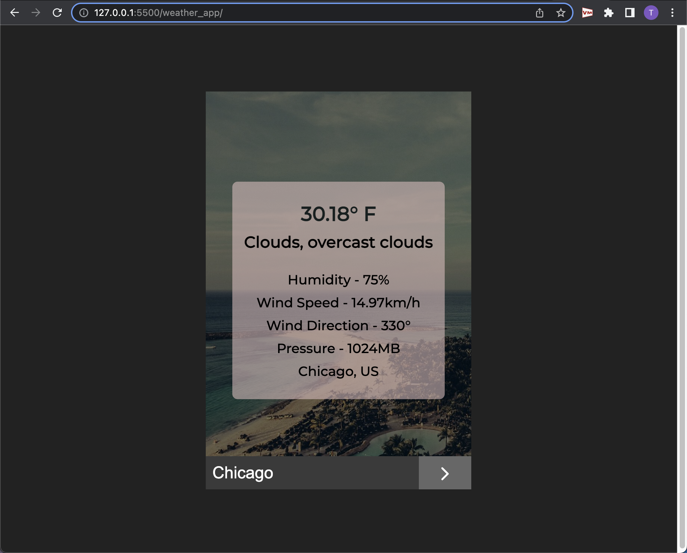

# Weather App
- Takes a city as an input
- Fetch data from an API: openweathermap.org
- Returns the current: temperature, conditions, humidity, 
  wind speed, wind direction, pressure, and query 
 
 
 
